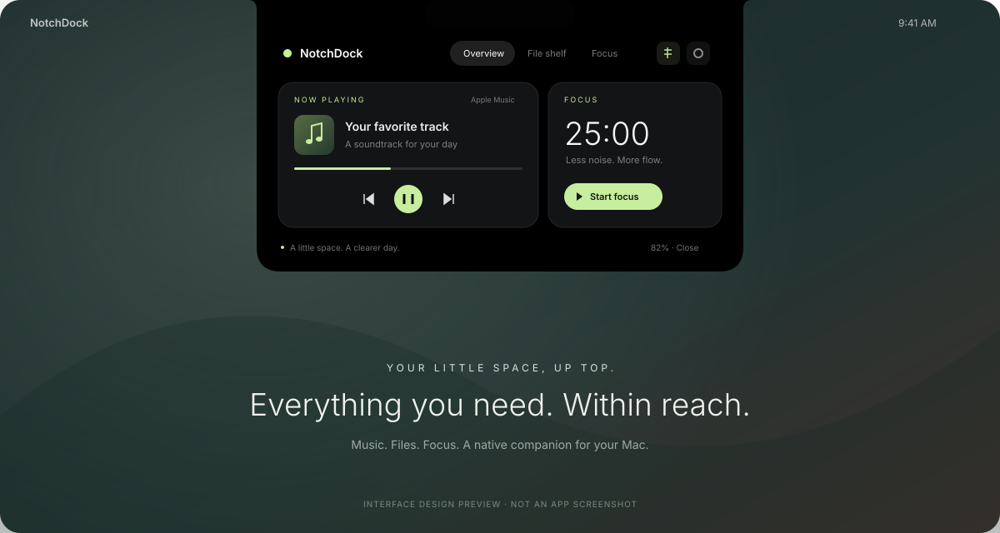

# NotchDock

**A little space. A clearer day.**

A native macOS notch companion with automatic media detection, files and AirDrop, a camera mirror, and focus timers. Built with SwiftUI and AppKit, with no third-party runtime dependencies. Inspired by the idea behind NotchNook; this is an independent implementation with its own name, interface, and code. It is not affiliated with NotchNook or lo.cafe.



> **Early version · 0.5.0.** See [recorded validation results](docs/VALIDATION.md) and the [macOS build workflow](https://github.com/ReivenGitHub/notchdock/actions/workflows/macos.yml) for actual build status. Native interaction and hardware testing remain separate from compilation. The image above illustrates the original design, not a current app screenshot.

## What it does

| Feature | Behavior |
| --- | --- |
| Quiet closed notch | Nothing is drawn beside the real camera notch while the panel is closed, even when media or a timer is active. Hover or click below it to open. |
| Automatic closing | The unpinned panel closes shortly after the pointer leaves the full interface. Pin it when you want it to remain open. |
| Automatic media | Detects active playback from Apple Music, Spotify, or YouTube in Chrome/Safari. Shows source, title, artist/channel, album/site, progress, controls, and cover art. |
| Files Tray | Up to 24 files/folders, a dedicated drop target, drag in/out, search, sorting, Quick Look, copy file/path, and Finder actions. |
| AirDrop | A separate drop target opens Apple's recipient picker. Also available from each file's menu or the menu bar. |
| Mirror | A live camera preview with horizontal flip and an off button. Camera stops when you leave Mirror or close the panel. |
| Focus & breaks | Custom focus, short-break, and long-break durations; pause/resume/reset; sound; saved state; today's completed focus totals. |
| Battery | Battery percentage and charging state; a desktop indicator on Macs without a battery. |
| Display support | Choose any connected display. Remembers the choice across reconnections; non-notched displays keep a small handle. |
| Keyboard | Record a custom global shortcut, reset to Option–Command–Space, or disable it. No Accessibility permission. |
| Settings | Idle and hover behavior, display, shortcut, session durations, completion behavior, music app, and launch at login. |

Files remain at their original locations. Removing a shelf item removes only its reference. The shelf restores after relaunch using local bookmarks. Media support covers Apple Music, Spotify, and YouTube or YouTube Music tabs in Google Chrome and Safari. Other websites and players are not inspected.

The physical camera cutout cannot display pixels. On a notched Mac, NotchDock draws nothing outside it whenever the panel is closed; a transparent two-point strip below it accepts hover and file drops. Media artwork, timers, and controls appear only after the interface opens. Unpin the panel to make it close automatically after the pointer leaves.

## Get it running on your Mac

Requires **macOS 13 Ventura or newer** and **Xcode 15+ or compatible Command Line Tools with Swift 5.9+** for a source build. The packaging script supports Apple silicon and Intel.

1. Download this repository using **Code → Download ZIP**, then unzip it.
2. If you need Apple's developer tools, open Terminal and run `xcode-select --install`.
3. Open Terminal in the unzipped project folder, then run:

```bash
bash scripts/build-app.sh
open build/NotchDock.app
```

You can also run `Build-NotchDock.command` from the project folder. The app lives in the menu bar and at the top of your display, so there is no Dock icon. On first launch, the panel stays pinned so you can explore it.

Drag `build/NotchDock.app` into **Applications** to keep it. Enable launch at login after moving it there.

### Download a GitHub build

**[Download NotchDock 0.5 for Apple silicon and Intel](https://github.com/ReivenGitHub/notchdock/actions/runs/35482583403/artifacts/10596049661)** — native compilation, all 56 tests, and universal-binary verification passed. The artifact expires October 4, 2026; see [verification details](docs/VALIDATION.md). Quit the old app before replacing it in Applications; existing shelf references, preferences, and timer state are preserved.

Open [Actions](https://github.com/ReivenGitHub/notchdock/actions/workflows/macos.yml), choose a successful **Build NotchDock for macOS** run, and download its **NotchDock-macOS** artifact. Unzip the download and the included `NotchDock-macOS.zip` to get the `.app`. The workflow builds both architectures and includes a SHA-256 checksum. It does not automatically publish a Release.

Local and CI builds are ad-hoc signed, not Apple notarized. A downloaded build may need explicit approval in **System Settings → Privacy & Security**. For broad distribution, use your Developer ID and the [signing instructions](docs/DISTRIBUTION.md).

### If macOS says “NotchDock” Not Opened

The GitHub build is ad-hoc signed and has not been notarized by Apple. macOS can therefore block its first launch with “Apple could not verify NotchDock is free of malware.”

If this is the build you downloaded from this repository and you choose to trust it:

1. Click **Done** in the warning.
2. Open **System Settings → Privacy & Security**.
3. Scroll to **Security**, find the entry for NotchDock, and click **Open Anyway**.
4. Confirm with **Open** and authenticate if macOS asks.

If the entry is missing, try opening the app once, then return to Privacy & Security. On a managed Mac, these controls may be restricted by the administrator.

This creates an exception for the app. It is not Apple notarization or a malware scan. See [Apple’s instructions](https://support.apple.com/en-us/102445). For a release that meets the normal Developer ID and notarization checks, follow the [distribution guide](docs/DISTRIBUTION.md).

## Use it

- **Open:** hover at the top center, click the compact panel, use the menu bar, or press **⌥⌘Space**.
- **Automatic close:** leave the panel unpinned and it closes shortly after the pointer leaves the complete interface, including from Mirror. Click the pin only when you want it to remain open. Close, Escape, or the toggle shortcut also hides it.
- **Media:** choose **Automatic** in Settings to detect active Apple Music, Spotify, Chrome YouTube, or Safari YouTube playback. You can lock detection to one source instead. Approve macOS Automation access when asked. Overview shows the cover, source, title, artist/channel, album/site, progress, and controls while the interface is open; nothing is added beside the closed hardware notch.
- **YouTube setup:** in Chrome or Safari, enable **Allow JavaScript from Apple Events** in the browser's Developer menu. This lets NotchDock read and control the video element in YouTube tabs. If it is disabled, the app shows setup guidance. NotchDock does not inspect non-YouTube tabs.
- **Files:** drag toward the notch to open Files. Drop on **Files Tray** to keep references or on **AirDrop** to choose a recipient. Search by name, sort, preview with the eye button, and drag cards out. Right-click a card to AirDrop, copy, open, reveal, or remove it. Originals stay in place.
- **AirDrop:** dropping files opens Apple's sharing window; you choose the recipient there. Click the target or use the menu bar to choose files instead. Wi-Fi, Bluetooth, receiver discoverability, and supported files are handled by macOS. AirDropped files are not also added to the tray.
- **Mirror:** click the Mirror tab or choose Open Mirror from the menu bar. Approve camera access if asked. Mirror stays open until you change tabs or close it, and can be flipped horizontally. The camera stops on exit, sleep, or session deactivation; after sleep, click Start mirror to resume.
- **Focus:** choose Focus, Short break, or Long break before starting. Set custom durations in Settings. Pause preserves remaining time; Reset cancels the session. Expired deadlines finish after wake or relaunch. Only completed focus sessions count toward today's totals.
- **Display & keyboard:** open Settings → Notch. Record a shortcut with Command, Option, or Control; Escape cancels recording. The menu bar works even when a shortcut is unavailable or disabled.
- **Quit:** choose Quit NotchDock from the menu bar menu.

If another app has registered the global shortcut, Settings reports it as unavailable; the menu bar remains usable.

## Develop

Open `Package.swift` in Xcode, or use Terminal:

```bash
python3 scripts/validate-project.py  # Static packaging checks
swift test --parallel               # Core tests; compiles the executable on macOS
bash scripts/package-app.sh universal
```

Test Automation and login items from the packaged `.app`. A raw `swift run` executable lacks the required bundle metadata. The Foundation-only core can also be tested on Linux with Swift 5.9+; the app target is included only on macOS.

- [Architecture and design decisions](docs/ARCHITECTURE.md)
- [Tests, manual QA, and current limits](docs/TESTING.md)
- [Recorded validation](docs/VALIDATION.md)
- [Signing and distribution](docs/DISTRIBUTION.md)
- [Implementation log and next steps](docs/DEVELOPMENT.md)
- [Changelog](CHANGELOG.md)

## Privacy

NotchDock has no accounts, analytics, or tracking. It reads battery status and, only when media is enabled, supported player metadata through Apple Events. Automatic mode checks only supported apps that are already running. Browser scripts inspect only YouTube/YouTube Music tabs and read the page's video element and Media Session metadata; other tabs are ignored. NotchDock never enables the browser's JavaScript-from-Apple-Events setting for you.

Spotify and YouTube artwork is fetched over HTTPS from the image URL supplied by the player, restricted to Spotify and Google/YouTube image CDN domains. These requests have no cookies, stored credentials, or persistent network cache. Titles and artists are not sent to an album-search service. Music artwork is read locally through a temporary file that is deleted after loading. The small decoded-cover cache is in memory only.

Mirror uses video input only while requested and visible. It does not save photos or recordings, access the microphone, or transmit camera frames. AirDrop hands selected file references to Apple's sharing service, and you select the recipient in macOS. The app does not read clipboard history, capture the screen, or use private MediaRemote APIs.

Shelf references, the current timer, and up to 200 completed sessions are stored under `~/Library/Application Support/NotchDock/`; settings use the `app.notchdock.desktop` user defaults domain. Version 0.2 restores the older timer file on first upgrade. Copy actions write to the clipboard only when requested. The app is not App Sandbox enabled. See the [architecture notes](docs/ARCHITECTURE.md) for file access details.

## License

[MIT](LICENSE). NotchNook, Apple Music, and Spotify names belong to their respective owners.
